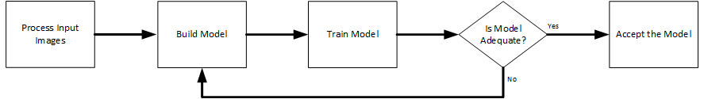
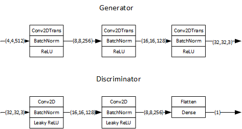
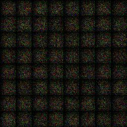
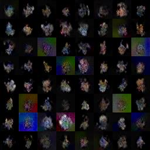
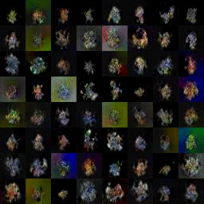

# PokeGAN v2: Faster and More "Meaningful" Pokemon
Salmon, Paulino III
<br>Sitosta, Timothy
<br>Sonday, Carlo Angelo
<br>Villena, Pierre Allan
***

## Abstract
For the final project, the proponents improve on existing experiments on GANs that produce new and unique Pokemon characters. The task of creating these new cartoons could be beneficial from providing inspirations only to Pokemon creators, up to creating new Pokemon for the franchise given that high resolution and sensible characters can be made. With common problems in existing experiments such as the lack of form of the generated Pokemon and sensibility of the images, the proponents propose the use of a new dataset to improve the quality of the output, as well as some changes to the code to be able to train the GAN in less epochs but still produce output with similar or better quality. This has been achieved with a Wesserstein GAN (WGAN) architecture that implemented via TensorFlow. 

## Table of Contents
1. [Background and Motivations](#1)
2. [Problem](#2)
3. [Objectives](#3)
4. [Methodology](#6)
5. [GAN Architechture](#4)
    1. [Dataset](#43)
    2. [Architecture](#41)
    3. [Training](#42)
6. [Results and Discussions](#5)
    1. [What can be done to improve](#51)

***


## Background and Motivations <a id='1'></a>
With the availability of computing capabilities, one of the AI tasks that are becoming more popular these days is the generation of multiple types of media. In recent years, a particular field of interest in this domain is the creation of [anime characters](https://medium.com/syncedreview/meet-your-ai-generated-dream-anime-girl-5dc149c5eab4). Given that cartoon characters are already generated, it is not far that we go from the anime girls to the lovable Pokemon.

The generation of Pokemon via AI can be considered an interesting subject simply because Pokemon are simply diverse, much like Earth's fauna. Improving AI systems that can work on generating these creatures from noise can be considered a big step towards training from a dataset with a fairly diverse set of shapes.   

AI focused on generating these Pokemon are not new. An example of this is [Yvan Scher's Monster GAN](https://medium.com/@yvanscher/using-gans-to-create-monsters-for-your-game-c1a3ece2f0a0). Monster GAN is somehow vanilla, although there was experimentation with leaky ReLU. The gif below shows progress over 125 epochs of training.


<center><small> <i>Image from https://miro.medium.com/max/475/1*byd8KFPL-OpfU8SX45osvg.gif</i></small> </center>

We have this experiment by *moxiegushi* [PokeGAN](https://github.com/moxiegushi/pokeGAN) which is a WGAN-based Pokemon generator. WGAN stands for Wasserstein GAN, and this is an alternative to the traditional GAN. WGAN uses the Wasserstein loss function instead of KL divergence that we are used to in Traditional GAN -- this is actually one of Scher's recommendations. PokeGAN's sample output is shown below. 


<center><small> <i>Image from courtesy of mixiegushi</i></small> </center>

In the PokeGAN output, it seems worse and more *abstract* than MonsterGAN, despite the improvements it may have presented, however, the image quality is superior. 

We also have to consider the files used in the two models when comparing quality. It seems like PokeGAN was trained on a dataset that can present the AI with more features, which can be why it looks more erratic. 

## Problem <a id='2'></a>

### Meaningfulness of Output
A glaring weakness of outputs from the generators mentioned above is the meaningfulness of the images. Monster GAN leads in giving the pokemon bodies, while PokeGAN leads when it comes to image quality. Regardless, it is clear that we are not really getting the Pokemon that can fool even the non-Pokemon enthusiasts.

### Why the Lack of Meaning?
While no explanations of these were provided by the experiments mentioned above, we speculate that this is because of the nature of the dataset. Pokemon have a wide variety of forms and body parts, hence, the GAN's discriminator cannot learn about the true form of a Pokemon -- at least in the epochs covered by the experiments.

There is no reason to stop, however, that the GAN cannot learn the necessary features. In Monster GAN, Scher is still able to suggest things to make things better: (1) to use WGAN, (2) use images with white background, and (3) experimentation on ReLU.

## Objectives <a id='3'></a>
The main objective of this test is to improve on the performance of existing Pokemon-focused GANs. More specifically, the proponents aim to perform the following:
1. To use a dataset with white background and smaller images. This is done to address the issue of the *meaninglessness* and to be able to have good results in time. 
2. To establish a GAN architecture that could process the given input data at a reasonable amount of epochs and time. 
3. Assess the quality of the proponents model and compare it to the existing Pokemon GAN experiments.

## Methodology <a id='6'></a>
For this project, the following methodology was applied. 

1. **Process Input Images** - Input images came from a variety of sources. For this experiment, all resized to a uniform dimension before being put into the model.
2. **Build Model** - The model was implemented on Tensorflow
3. **Train Model** - The GAN was trained over a specified number of epochs.
4. **Accept the Model** - Once the generated outputs were satisfactory, the results were accepted and discussed. 

## GAN Architecture and Training <a id='4'></a>

### Dataset <a id='43'></a>
For this project, we would like to use **Pokemon Sprites** -- or small and lightweight images. These images are chosen initially because of their size, but the colors also have high contrasts, which can help detect features better. For the experiment, we were able to use 809 sprites from [pokemon.db](https://pokemondb.net/sprites).


<center><small> <i>Sprites samples</i></small> </center>

### Architecture <a id='41'></a>

Since *moxiegushi*'s WGAN is already an improvement of Scher's GAN and has implemented some recommendations, we attempt to improve the WGAN model. The architecture is implemented via ***TensorFlow***.




The **generator** takes in a noise tensor that is initially in (4,4,512) in dimension. We then put the image through the following layers: Conv2DTranspose - Batch Normalization - ReLU until we reach the desired image dimension of (32, 32, 3). The three layers serve three-fold
1. Increase the height and width of the image by a factor of 2 (by setting strides = 2) and decrease the number of channels by a factor of 2 as well (by dividing the succeeding layer's kernels by 2).
2. Normalize the convoluted values to ensure that values do not fluctuate, causing inflated errors.
3. Activate the images as usual. 

The three-layer composite is used until the desired dimension is met. Once the tensor is at (16,16,128), the convolution layer then uses only 3 kernels so we can get to (32,32,3). 


While the generator creates images from noise, the **discriminator** is our usual classifier to detect if an image is real or fake. The architecture is analogous to the generator, but the size of the original discriminator is a single value (derived via a single-unit Dense layer).

A deviation from the *analogous* architecture would be the use of **Leaky ReLU** in the discriminator versus the **ReLU** in the generator. The use of **Leaky ReLU** is mainly to speed up learning of the generator since it allows a gradient value for negative values of the discriminator value. For this experiment, we use Leaky ReLU parameter of *alpha = 0.2* as a default value. Given resources, this could have been modified and played with.

### Wasserstein Loss

Finally, we find here that the final result is **not activated** and this is a contibution of WGAN.For WGAN, we use the *unactivated* discriminator results to compute the **Wasserstein distance** which will be minimized via **RMSProp**. In this case, the Wasserstein distance can be computed as follows. 
* Generator: ```-tf.reduce_mean(fake_result)```
* Discriminator: ```tf.reduce_mean(fake_result) - tf.reduce_mean(real_result)```

Where ```fake_result``` is the discriminator output for fake images while ```real_result``` is for the real images. Conveniently, the losses (or distances) are just computed via the simple average. Given the Wasserstein distance, we see that it emphasizes that fake results must be classified as real images as by the discriminator and that the discriminator learns as well by correctly classifying the real results. The generator *learns if the discriminator is able to classify a fake image as a real image*.

In presenting [Monster GAN](https://medium.com/@yvanscher/using-gans-to-create-monsters-for-your-game-c1a3ece2f0a0), he has suggesten to use Wasserstein Loss instead for the loss function, but he has not provided any reasons why. In a [2007 article by Weng](https://lilianweng.github.io/lil-log/2017/08/20/from-GAN-to-WGAN.html), however, she explains that WGAN works because this makes the discriminator not only a *direct critic*, but also a *helper* in determining the value of the Wasserstein metric -- which translates to better image quality versus DCGAN.  

### Training <a id='42'></a>

#### Training Parameters

Training was performed with the following parameters. 
```
HEIGHT, WIDTH, CHANNEL = 32, 32, 3
BATCH_SIZE = 64
EPOCH = 5000
```
Training is done on small images so we could maximize the number of training epochs. The epoch is initially set to 5000, but checkpoints were established so that the progress can be checked and training could be stopped once results are satisfactory. 

#### Optimization and Generalization Settings

To train the GAN, the following optimizers were put in place. 
``` 
trainer_d = tf.train.RMSPropOptimizer(learning_rate=2e-4).minimize(d_loss, var_list=d_vars)
trainer_g = tf.train.RMSPropOptimizer(learning_rate=2e-4).minimize(g_loss, var_list=g_vars)
```
The use of RMSProp as optimizer is based on the proposed [WGAN by Arjovsky(2017)](https://arxiv.org/abs/1701.07875). It is mainly to assist for fast training. 

Checkpoints and samples were also taken every 500 and 50 epochs, respectively. This was executed via the following code.
```
if i%500 == 0:
    if not os.path.exists('./model/' + version):
        os.makedirs('./model/' + version)
        saver.save(sess, './model/' +version + '/' + str(i))  
    if i%50 == 0:
        # save images
        if not os.path.exists(newPoke_path):
        os.makedirs(newPoke_path)
        sample_noise = np.random.uniform(-1.0, 1.0, size=[batch_size, random_dim]).astype(np.float32)
        imgtest = sess.run(fake_image, feed_dict={random_input: sample_noise, is_train: False})
        # imgtest = imgtest * 255.0
        # imgtest.astype(np.uint8)
        save_images(imgtest, [8,8] ,newPoke_path + '/epoch' + str(i) + '.jpg')
```

## Results and Discussions <a id='5'></a>

The following shows the progress of what we deem PokeGANv2. Our output prides itself as lightweight as it has shallow networks only, but powerful as it is able to produce the PokeMon. 


<center><small> <i>Epoch 0</i></small> </center>


<center><small> <i>Epoch 200</i></small> </center>


<center><small> <i>Epoch 400</i></small> </center>

As seen in the photos, we are already able to see figures of Pokemon with defined body shapes. There is surely a lack of detail, but that can be attributed to the dimensions of the image which is very small. With resources, however, this can be easily improved. 


<center><small> <i>MonsterGAN Output</i></small> </center>

Comparing to the benchmarks, PokeGAN v2 seems comparable to MonsterGAN when it comes to the monsters having a Pokemon's form. However, we still lack when it comes to resolution. This can easily be attributed to the depth of the networks.


<center><small> <i>PokeGAN Output</i></small> </center>

Comparing versus PokeGAN, our output has more sense despite the smaller resolution. Noting that the GAN used to generate this one is a much shallower one, we could say that this experiment is a success. 


### What can be done to imrpove? <a id='51'></a>
To get more details from the GAN, we suggest the following changes to the architecture.
1. Play with Leaky ReLU units - This was already suggested by Scher but, unfortunately, we did not have the luxury time and resources to play with the model.
2. Deepen the network - Given the input data, we can deepen the network more to extract more features and get more details. Deepening the network also allows to make images with higher resolution.
3. Augment the dataset - Sprites were used initially because they are lightweight, however, the fact that they have white backgrounds really helped our cause in creating a quick-learning model. We recommend increasing the number of sprites to use. 
4. Increase the image resolutions - This can enable us to see more detail in the output.
